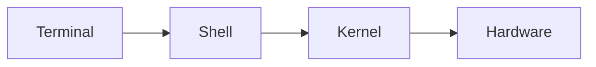
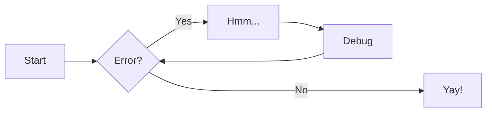
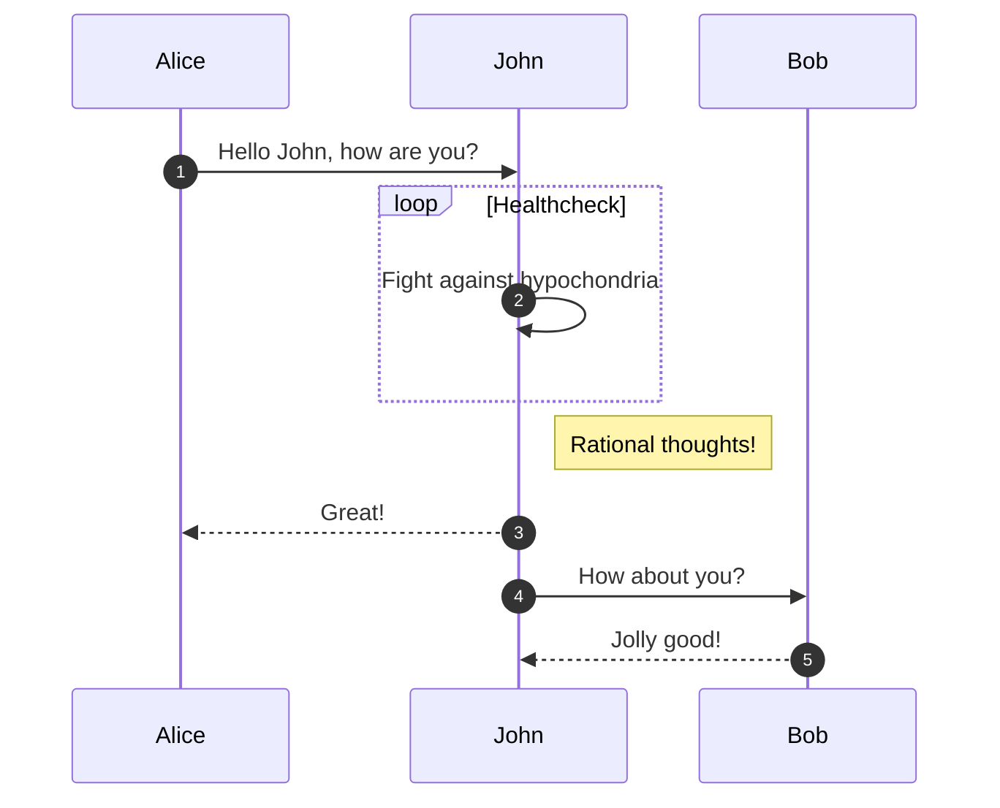
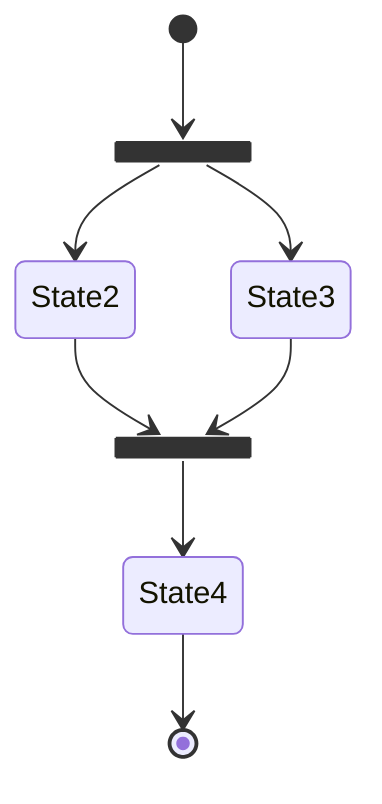
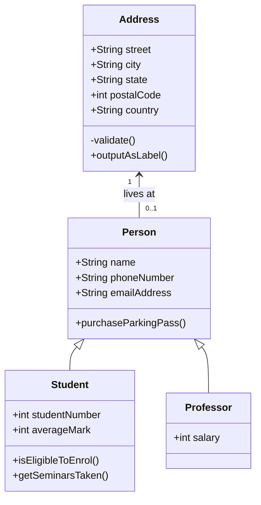
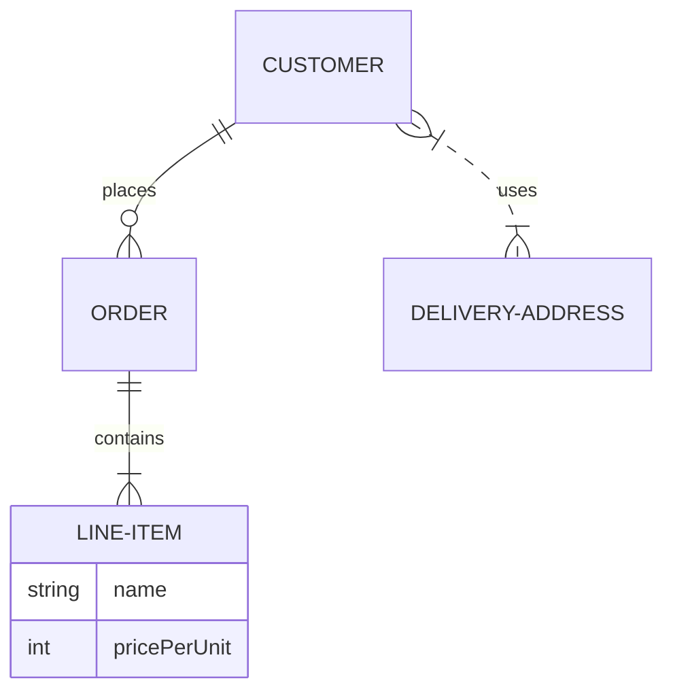

# Basics of Zensical

## Setup

### Navigation

``` markdown title="Hide Sidebars"
---
hide:
  - navigation
  - toc
---

# Page title
...
```

``` markdown title="Hide Navigation Path"
---
hide:
  - path
---

# Page title
...
```

### Search Exclusion

``` markdown title="Exclude a page - search exclusion"
---
search:
  exclude: true
---

# Page title
...
```

``` markdown title="Exclude a section - attribute lists"
# Page title

## Section 1

The content of this section is included

## Section 2 { data-search-exclude }

The content of this section is excluded
```

``` markdown title="Exclude a block - attribute lists"
# Page title

The content of this block is included

The content of this block is excluded
{ data-search-exclude }
```

### Site Analytics 

``` markdown title="Hide feedback widget"
---
hide:
  - feedback
---

# Page title
...
```

### Tags

``` markdown title="Add tags - icons/compact in zensical toml read"
---
tags:
  - HTML5
  - JavaScript
  - CSS
---

# Page title
...
```

``` markdown title="Hide tags - icons/compact in zensical toml read"
---
hide:
  - tags
---

# Page title
...
```

### Header

``` markdown title="Annoucement bar"



  <!-- Add announcement here, including arbitrary HTML -->

```

### Footer

``` markdown title="Hiding prev/next links"
---
hide:
  - footer
---

# Page title
...
```

### Comment System - exists

## Authoring

For full documentation visit [zensical.org](https://zensical.org/docs/).

### Commands

* [`zensical new`][new] - Create a new project
* [`zensical serve`][serve] - Start local web server
* [`zensical build`][build] - Build your site

  [new]: https://zensical.org/docs/usage/new/
  [serve]: https://zensical.org/docs/usage/preview/
  [build]: https://zensical.org/docs/usage/build/

### Examples

#### Front Matter
``` markdown title="Page Title, Description, Icon"
---
title: Lorem ipsum dolor sit amet
description: Nullam urna elit, malesuada eget finibus ut, ac tortor.
icon: lucide/braces
---

# Page title
...
```

##### Page Status

A status can be assigned to each page, which is displayed as part of navigation sidebar. There is a status identifer. There are already defined new and deprecated. 

``` toml title="Page Status TOML"
[project.extra.status]
<identifier>: "<description>"
```
``` markdown title="Set Status"
---
status: new
---

# Page title
...
```

#### Good to know

Use `ls -la` to list files
The `-a` flag shows hidden files
Edit `~/.bashrc` to configure your shell

Press ++ctrl+c++ to cancel a command
Use ++ctrl+z++ to suspend a process
++tab++ to autocomplete
++ctrl+alt+del++

**bold text**
*italic text*
***bold and italic***

~~this is deleted~~

H^2^O        ← superscript
CO~2~        ← subscript

`#!bash ls -la`
`#!python print("hello")`

`ls`
:   Lists directory contents

`cd`
:   Changes the current directory

`pwd`
:   Prints working directory

The CLI is very powerful.

*[CLI]: Command Line Interface
*[SSH]: Secure Shell

=== "Linux"
```bash
    ls -la
```
=== "Mac"
```bash
    ls -la
```
=== "Windows"
```powershell
    dir
```

- [x] Open terminal
- [ ] Navigate to home directory
- [ ] Create a new folder

This command is dangerous.[^1]

[^1]: Always make a backup before running this.

[visible text](https://example.com)
[internal page](../section2/commands.md)
[jump to heading](#file-permissions)


{ width="400" }

| Command | Description      | Example     |
|---------|-----------------|-------------|
| `ls`    | List files      | `ls -la`    |
| `cd`    | Change directory| `cd ~/docs` |
| `pwd`   | Print directory | `pwd`       |

---

> No such file or directory

\`not code\`
\*not italic\*
\# not a heading

First line  
Second line  ← two spaces at end forces a line break



```bash title="list files"
ls -la
```

```bash
ls -la # (1)
```

1. The `-l` flag shows long format, `-a` shows hidden files

--8<-- "scripts/example.sh"

<div class="grid cards" markdown>

- :lucide-terminal: **ls** — List directory contents
- :lucide-folder: **cd** — Change directory
- :lucide-file: **touch** — Create a file

</div>

#### Admonitions - call-outs

You can customize the icons, learn more at Admonitions if necessary. Follows syntax of !!! note or ???, use a ???+ for expanded rendedered, Quotes of ??? "" no title. You can inline with info inline *end* ""

> Go to [documentation](https://zensical.org/docs/authoring/admonitions/)

!!! note
!!! abstract
!!! tip
!!! warning
!!! danger
!!! info
!!! success
!!! question
!!! failure
!!! example
!!! quote

#### Buttons

[Subscribe to our newsletter](#){ .md-button }

[Subscribe to our newsletter](#){ .md-button .md-button--primary }

[Send :fontawesome-solid-paper-plane:](#){ .md-button }

#### Details

> Go to [documentation](https://zensical.org/docs/authoring/admonitions/#collapsible-blocks)

??? info "Click to expand for more info"
    
    This content is hidden until you click to expand it.
    Great for FAQs or long explanations.

### Code Blocks

> Go to [documentation](https://zensical.org/docs/authoring/code-blocks/)

``` python hl_lines="2" title="Code blocks"
def greet(name):
    print(f"Hello, {name}!") # (1)!

greet("Python")
```

``` py
import tensorflow as tf
```

``` py title="bubble_sort.py"
def bubble_sort(items):
    for i in range(len(items)):
	for j in range(len(items) - 1 - i):
	    if items[j] > items[j + 1]:
		items[j], items[j + 1] = items[j + 1], items[j]
```

``` toml
[project.theme]
features = ["content.code.annotate"] # (1)!
```

1.  :man_raising_hand: I'm a code annotation! I can contain `code`, __formatted
    text__, images, ... basically anything that can be written in Markdown.

``` yaml
# (1)!
```

1.  Look ma, less line noise!

``` py linenums="1"
def bubble_sort(items):
    for i in range(len(items)):
	for j in range(len(items) - 1 - i):
	    if items[j] > items[j + 1]:
		items[j], items[j + 1] = items[j + 1], items[j]
```

``` py hl_lines="2 3"
def bubble_sort(items):
    for i in range(len(items)):
	for j in range(len(items) - 1 - i):
	    if items[j] > items[j + 1]:
		items[j], items[j + 1] = items[j + 1], items[j]
```

The `#!python range()` function is used to generate a sequence of numbers.

1.  > Go to [documentation](https://zensical.org/docs/authoring/code-blocks/#code-annotations)

    Code annotations allow to attach notes to lines of code.

Code can also be highlighted inline: `#!python print("Hello, Python!")`.

### Content tabs

> Go to [documentation](https://zensical.org/docs/authoring/content-tabs/)

=== "Python"

    ``` python
    print("Hello from Python!")
    ```

=== "Rust"

    ``` rs
    println!("Hello from Rust!");
    ```

=== "Unordered list"

    * Sed sagittis eleifend rutrum
    * Donec vitae suscipit est
    * Nulla tempor lobortis orci

=== "Ordered list"

    1. Sed sagittis eleifend rutrum
    2. Donec vitae suscipit est
    3. Nulla tempor lobortis orci

!!! example

    === "Unordered List"

	``` markdown
	* Sed sagittis eleifend rutrum
	* Donec vitae suscipit est
	* Nulla tempor lobortis orci
	```

    === "Ordered List"

	``` markdown
	1. Sed sagittis eleifend rutrum
	2. Donec vitae suscipit est
	3. Nulla tempor lobortis orci
	```
### Data Tables

| Method      | Description                          |
| :---------- | :----------------------------------- |
| `GET`       | :lucide-check:       Fetch resource  |
| `PUT`       | :lucide-check-check: Update resource |
| `DELETE`    | :lucide-x:           Delete resource |

### Diagrams

> Go to [documentation](https://zensical.org/docs/authoring/diagrams/)











There is also from Mermaid.js, pie charts, gantt charts, user journeys, git graphs, and requirement diagrams. But not officially supported by Zensical, don't consider good choice for mobile (should work as advertized).

### Footnotes

> Go to [documentation](https://zensical.org/docs/authoring/footnotes/)

Here's a sentence[^2] with a footnote.[^1]

Hover it, to see a tooltip.

[^1]: This is the footnote.

[^2]:
    Lorem ipsum dolor sit amet, consectetur adipiscing elit. Nulla et euismod
    nulla. Curabitur feugiat, tortor non consequat finibus, justo purus auctor
    massa, nec semper lorem quam in massa.

### Formatting

> Go to [documentation](https://zensical.org/docs/authoring/formatting/)

- ==This was marked (highlight)==
- ^^This was inserted (underline)^^
- ~~This was deleted (strikethrough)~~
- H~2~O
- A^T^A
- ++ctrl+alt+del++
++ctrl+alt+del++

### Grids

<div class="grid cards" markdown>

- :fontawesome-brands-html5: __HTML__ for content and structure
- :fontawesome-brands-js: __JavaScript__ for interactivity
- :fontawesome-brands-css3: __CSS__ for text running out of boxes
- :fontawesome-brands-internet-explorer: __Internet Explorer__ ... huh?

</div>

<div class="grid cards" markdown>

-   :material-clock-fast:{ .lg .middle } __Set up in 5 minutes__

    ---

    Install [`zensical`](#) with [`pip`](#) and get up
    and running in minutes

    [:octicons-arrow-right-24: Getting started](#)

-   :fontawesome-brands-markdown:{ .lg .middle } __It's just Markdown__

    ---

    Focus on your content and generate a responsive and searchable static site

    [:octicons-arrow-right-24: Reference](#)

-   :material-format-font:{ .lg .middle } __Made to measure__

    ---

    Change the colors, fonts, language, icons, logo and more with a few lines

    [:octicons-arrow-right-24: Customization](#)

-   :material-scale-balance:{ .lg .middle } __Open Source, MIT__

    ---

    Zensical is licensed under MIT and available on [GitHub]

    [:octicons-arrow-right-24: License](#)

</div>

<div class="grid" markdown>

:fontawesome-brands-html5: __HTML__ for content and structure
{ .card }

:fontawesome-brands-js: __JavaScript__ for interactivity
{ .card }

:fontawesome-brands-css3: __CSS__ for text running out of boxes
{ .card }

> :fontawesome-brands-internet-explorer: __Internet Explorer__ ... huh?

</div>

<div class="grid" markdown>

=== "Unordered list"

    * Sed sagittis eleifend rutrum
    * Donec vitae suscipit est
    * Nulla tempor lobortis orci

=== "Ordered list"

    1. Sed sagittis eleifend rutrum
    2. Donec vitae suscipit est
    3. Nulla tempor lobortis orci

``` title="Content tabs"
=== "Unordered list"

    * Sed sagittis eleifend rutrum
    * Donec vitae suscipit est
    * Nulla tempor lobortis orci

=== "Ordered list"

    1. Sed sagittis eleifend rutrum
    2. Donec vitae suscipit est
    3. Nulla tempor lobortis orci
```

</div>

=== "Unordered list"

    * Sed sagittis eleifend rutrum
    * Donec vitae suscipit est
    * Nulla tempor lobortis orci

=== "Ordered list"

    1. Sed sagittis eleifend rutrum
    2. Donec vitae suscipit est
    3. Nulla tempor lobortis orci

### Icons, Emojis

> Go to [documentation](https://zensical.org/docs/authoring/icons-emojis/)

* :sparkles: `:sparkles:`
* :rocket: `:rocket:`
* :tada: `:tada:`
* :memo: `:memo:`
* :eyes: `:eyes:`
:fontawesome-regular-face-laugh-wink:

### Images

{ align=left }

<figure markdown="span">
  { width="300" }
  <figcaption>Image caption</figcaption>
</figure>


## Lists

- Nulla et rhoncus turpis. Mauris ultricies elementum leo. Duis efficitur
  accumsan nibh eu mattis. Vivamus tempus velit eros, porttitor placerat nibh
  lacinia sed. Aenean in finibus diam.

    * Duis mollis est eget nibh volutpat, fermentum aliquet dui mollis.
    * Nam vulputate tincidunt fringilla.
    * Nullam dignissim ultrices urna non auctor.

1.  Vivamus id mi enim. Integer id turpis sapien. Ut condimentum lobortis
    sagittis. Aliquam purus tellus, faucibus eget urna at, iaculis venenatis
    nulla. Vivamus a pharetra leo.

    1.  Vivamus venenatis porttitor tortor sit amet rutrum. Pellentesque aliquet
	quam enim, eu volutpat urna rutrum a. Nam vehicula nunc mauris, a
	ultricies libero efficitur sed.

    2.  Morbi eget dapibus felis. Vivamus venenatis porttitor tortor sit amet
	rutrum. Pellentesque aliquet quam enim, eu volutpat urna rutrum a.

	1.  Mauris dictum mi lacus
	2.  Ut sit amet placerat ante
	3.  Suspendisse ac eros arcu

`Lorem ipsum dolor sit amet`

:   Sed sagittis eleifend rutrum. Donec vitae suscipit est. Nullam tempus
    tellus non sem sollicitudin, quis rutrum leo facilisis.

`Cras arcu libero`

:   Aliquam metus eros, pretium sed nulla venenatis, faucibus auctor ex. Proin
    ut eros sed sapien ullamcorper consequat. Nunc ligula ante.

    Duis mollis est eget nibh volutpat, fermentum aliquet dui mollis.
    Nam vulputate tincidunt fringilla.
    Nullam dignissim ultrices urna non auctor.

- [x] Lorem ipsum dolor sit amet, consectetur adipiscing elit
- [ ] Vestibulum convallis sit amet nisi a tincidunt
    * [x] In hac habitasse platea dictumst
    * [x] In scelerisque nibh non dolor mollis congue sed et metus
    * [ ] Praesent sed risus massa
- [ ] Aenean pretium efficitur erat, donec pharetra, ligula non scelerisque

### Maths

> Go to [documentation](https://zensical.org/docs/authoring/math/)

$$
\cos x=\sum_{k=0}^{\infty}\frac{(-1)^k}{(2k)!}x^{2k}
$$

The homomorphism $f$ is injective if and only if its kernel is only the
singleton set $e_G$, because otherwise $\exists a,b\in G$ with $a\neq b$ such
that $f(a)=f(b)$.

!!! warning "Needs configuration"
    Note that MathJax is included via a `script` tag on this page and is not
    configured in the generated default configuration to avoid including it
    in a pages that do not need it. See the documentation for details on how
    to configure it on all your pages if they are more Maths-heavy than these
    simple starter pages.

<script id="MathJax-script" async src="https://unpkg.com/mathjax@3/es5/tex-mml-chtml.js"></script>
<script>
  window.MathJax = {
    tex: {
      inlineMath: [["\\(", "\\)"]],
      displayMath: [["\\[", "\\]"]],
      processEscapes: true,
      processEnvironments: true
    },
    options: {
      ignoreHtmlClass: ".*|",
      processHtmlClass: "arithmatex"
    }
  };
</script>

### Task Lists

> Go to [documentation](https://zensical.org/docs/authoring/lists/#using-task-lists)

* [x] Install Zensical
* [x] Configure `zensical.toml`
* [x] Write amazing documentation
* [ ] Deploy anywhere

### Tooltips

> Go to [documentation](https://zensical.org/docs/authoring/tooltips/)

[Hover me][example]

  [example]: https://example.com "I'm a tooltip!"

[Hover me](https://example.com "I'm a tooltip!")

:material-information-outline:{ title="Important information" }

The HTML specification is maintained by the W3C.

*[HTML]: Hyper Text Markup Language
*[W3C]: World Wide Web Consortium
